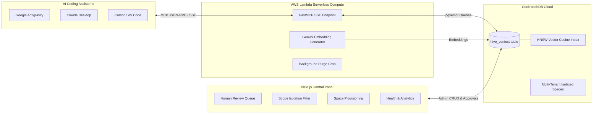

# HiveContext: Collective Memory System for AI Agent Teams

[](https://opensource.org/licenses/MIT)
[](https://www.cockroachlabs.com/)
[](https://aws.amazon.com/serverless/sam/)

**HiveContext** is an open-source, organization-level memory and context synchronization engine for software engineering teams using AI coding assistants (such as **Google Antigravity**, **Claude Desktop**, and **Cursor**).

It bridges the gap between fragmented developer AI sessions by persisting approved architectural decision records (ADRs), team coding conventions, incident retrospectives, and infrastructure specs inside a globally resilient **CockroachDB pgvector** database accessible via a serverless **AWS Lambda FastMCP** server.

---

## Live Interactive Showcase & Documentation

Experience the live interactive closed-loop memory lifecycle:  
**[Launch Interactive GitHub Pages Demo](https://sudhir-asuracore.github.io/HiveContext/)**

---

## Architecture Overview



---

## Modular Component Repositories

HiveContext is architected into modular open-source repositories:

| Repository | Description | Key Technologies |
| :--- | :--- | :--- |
| **[HiveContext-Dashboard](https://github.com/sudhir-asuracore/HiveContext-Dashboard)** | Central management console for team leads and developers to review, approve, scope, and monitor collective memory. | Next.js 16, React 19, TailwindCSS v4, NextAuth.js, pg |
| **[HiveContext-MCP](https://github.com/sudhir-asuracore/HiveContext-MCP)** | Serverless Model Context Protocol (MCP) server providing RAG vector search, memory persistence, and auto-purge cron on AWS Lambda. | Python 3.12, FastMCP, AWS SAM, Google Gemini API, CockroachDB |

---

## The Agent Memory Taxonomy: Why HiveContext?

Most agent memory discussions conflate **isolated agent memory** with **shared engineering context**:

| Memory Dimension | Storage Layer | Scope | Purpose |
| :--- | :--- | :--- | :--- |
| **Short-Term Memory** | Local RAM / Context Window | Single session (Human + Agent) | Scratchpad, active conversation buffer, AST diffs |
| **Semantic Memory** | Local Vector Index / Embeddings | Single agent | Concept definitions, language semantics, codebase grep |
| **Episodic Memory** | Local Agent Store / Session DB | Single developer history | "What was I working on yesterday in branch feature/auth?" |
| **Procedural Memory (HiveContext)** | **Global CockroachDB Vector Ledger + FastMCP** | **Multi-Agent / Entire 10+ Engineer Team** | **"How does our team write code, handle incidents, structure APIs, and make architectural tradeoffs?"** |

### The 10-Engineer Problem & Collective Brain Power

Imagine **10 software engineers** collaborating on the same monorepo, each pair programming with their own AI agent (Antigravity, Cursor, Claude):

1. **Without HiveContext (Isolated Agent Silos)**:
   - Engineer #1's agent encounters a non-trivial CockroachDB transaction retry bug, spends 30 minutes experimenting, wasting tokens, undoing and redoing code, before finally discovering the fix.
   - Tomorrow, Engineer #4's agent encounters the *exact same problem* and repeats the *exact same 30-minute trial-and-error cycle*.
   - Each agent operates in complete isolation, continuously re-learning the same hard lessons and producing inconsistent architectural styles.

2. **With HiveContext (Procedural Collective Intelligence)**:
   - When Engineer #1's agent solves the incident, it persists a **governed procedural memory** (`log_post_mortem` or `remember_convention`).
   - The team lead approves it in the **HiveContext Dashboard**.
   - Seconds later, when Engineer #4's agent initiates a task on that module, its pre-task `search_context` immediately recalls the proven solution.
   - **Result**: All agents across the organization act as a **unified, smarter, targeted brain**—instantly cutting token consumption, eliminating trial-and-error rollback loops, and accelerating time-to-delivery.

---

## Key Features

1. **Procedural Memory Synchronization**: Gathers validated procedures and ADRs from one agent to enhance the collective intelligence of all team agents.
2. **Eliminates Trial-and-Error Waste**: Prevents repetitive experimenting, undoing, and redoing across developers—driving straight to the team's approved approach.
3. **Human-in-the-Loop Governance**: Agent-proposed memories enter a pending state with automatic semantic conflict detection, requiring reviewer approval before mutating team standards.
4. **Multi-Tenant Scope Isolation**: Partition collective knowledge into `global` (organization-wide) or `project` scopes.
5. **Sub-15ms Resilient Recall**: Powered by CockroachDB v24.1+ distributed HNSW cosine vector index.
6. **Serverless Compute**: Deployed on AWS Lambda Function URLs with FastMCP SSE streaming and automated 30-day recycle bin cleanup.

---

## Quick Client Setup (`~/.mcp.json`)

Add the HiveContext server to your AI assistant configuration:

```json
{
  "mcpServers": {
    "hivecontext": {
      "serverUrl": "https://<your-lambda-url>.lambda-url.<region>.on.aws/sse",
      "headers": {
        "Authorization": "Bearer <your-mcp-secret-token>",
        "X-HiveContext-Tenant": "default"
      }
    }
  }
}
```

---

## License & Contributing

- **License**: Released under the [MIT License](LICENSE).
- **Contributing**: Please see [CONTRIBUTING.md](CONTRIBUTING.md) for local development and pull request guidelines.
