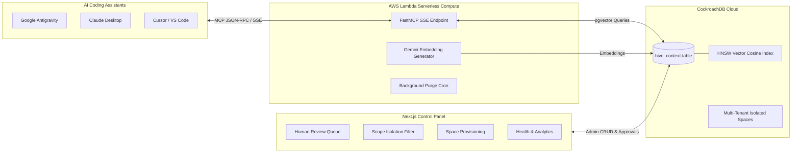

# HiveContext: Collective Memory System for AI Agent Teams

[](https://opensource.org/licenses/MIT)
[](https://www.cockroachlabs.com/)
[](https://aws.amazon.com/serverless/sam/)

**HiveContext** is an open-source, organization-level memory and context synchronization engine for software engineering teams using AI coding assistants (such as **Google Antigravity**, **Claude Desktop**, and **Cursor**).

It bridges the gap between fragmented developer AI sessions by persisting approved architectural decision records (ADRs), team coding conventions, incident retrospectives, and infrastructure specs inside a globally resilient **CockroachDB pgvector** database accessible via a serverless **AWS Lambda FastMCP** server.

---

## 🌐 Live Interactive Showcase & Documentation

Experience the live interactive closed-loop memory lifecycle:  
👉 **[Launch Interactive GitHub Pages Demo](https://sudhir-asuracore.github.io/HiveContext/)**

---

## 🧩 Architecture Overview



---

## 📦 Modular Component Repositories

HiveContext is architected into modular open-source repositories:

| Repository | Description | Key Technologies |
| :--- | :--- | :--- |
| 🎛️ **[HiveContext-Dashboard](https://github.com/sudhir-asuracore/HiveContext-Dashboard)** | Central management console for team leads and developers to review, approve, scope, and monitor collective memory. | Next.js 16, React 19, TailwindCSS v4, NextAuth.js, pg |
| ⚡ **[HiveContext-MCP](https://github.com/sudhir-asuracore/HiveContext-MCP)** | Serverless Model Context Protocol (MCP) server providing RAG vector search, memory persistence, and auto-purge cron on AWS Lambda. | Python 3.12, FastMCP, AWS SAM, Google Gemini API, CockroachDB |

---

## 🚀 Key Features

1. **Pre-Task Context Recall**: Agents run semantic searches before complex coding tasks to adhere to active conventions without manual prompt copying.
2. **Human-in-the-Loop Governance**: Agent-proposed memories enter a pending state with automatic semantic conflict detection, requiring reviewer approval before mutation.
3. **Multi-Tenant Scope Isolation**: Partition collective knowledge into `global` (organization-wide) or `project` scopes.
4. **Resilient Vector Search**: Powered by CockroachDB v24.1+ distributed HNSW cosine vector index for sub-15ms recall.
5. **Cost-Effective Serverless Compute**: Deployed on AWS Lambda Function URLs with SSE response streaming and automated 30-day recycle bin cleanup.

---

## 🛠️ Quick Client Setup (`~/.mcp.json`)

Add the HiveContext server to your AI assistant configuration:

```json
{
  "mcpServers": {
    "hivecontext": {
      "serverUrl": "https://<your-lambda-url>.lambda-url.<region>.on.aws/sse",
      "headers": {
        "Authorization": "Bearer <your-mcp-secret-token>",
        "X-HiveContext-Tenant": "default"
      }
    }
  }
}
```

---

## 📄 License & Contributing

- **License**: Released under the [MIT License](LICENSE).
- **Contributing**: Please see [CONTRIBUTING.md](CONTRIBUTING.md) for local development and pull request guidelines.
